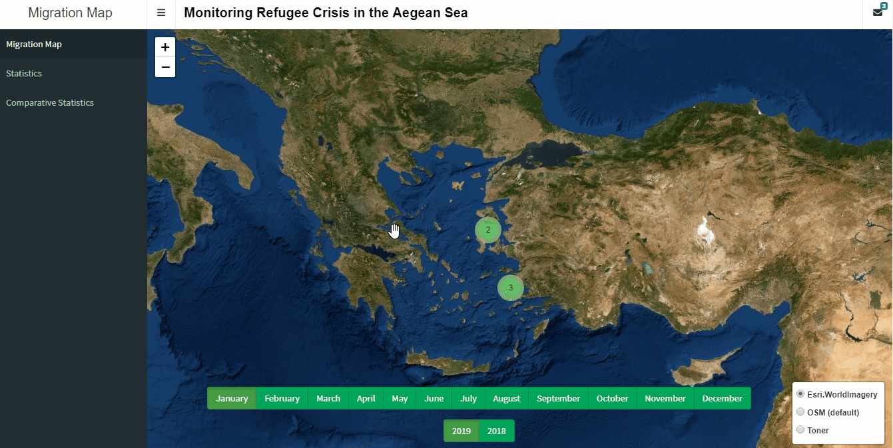

**Monitoring Refugee Crisis in the Aagean Sea**

This Shiny app is focused on tracking and mapping the refugee crisis in the Aegean Sea. Our motivation and data come from the Aegean Boat Report (https://aegeanboatreport.com/), which is an independent and volunteer-run media site. 

We extracted the refugee data from this web site for the period January 2018-December 2019 and the retrieved data set involves the following information: 

* Boats arrived: The number of boats arrived an island, 
* Total arrivals: The number of total arrivals to the island via boats,  
* Transfers to mainland: The number of people who moved from the island to Greece mainland, and 
* Total population: The total number of refugees left in the island,

for the Greek islands Kos, Chios, Samos,  Lesvos, and Other  from January 2018 to December 2019. 

The main window of the Shiny app uses Leaflet library to map the “Boats arrived”, “Total arrivals”, “Transfers to mainland” and “Total population” onto the Greek islands via pop-up windows where the date is integrated by green radio buttons. Furthermore, under Statistics section, we used R package dygraphs to display “Boats arrived”, “Total arrivals”, “Transfers to mainland” and “Total population” for each Greek island over the aforementioned period.  The Comparative statistics section enables us to see all the available information in one graph.

While full link to the Shiny app is available at https://taylanbt.shinyapps.io/interactive_turkey_map_-_migration/, a short video for our Shiny app in .gif format is given below. Also, this project can be viewed at https://rstudio.cloud/project/1055988.

